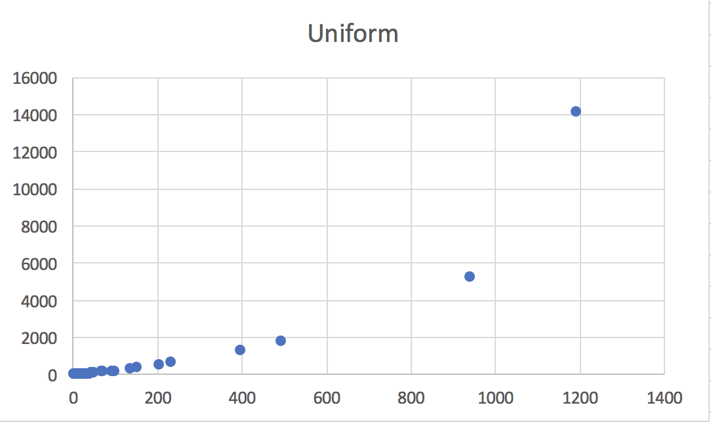
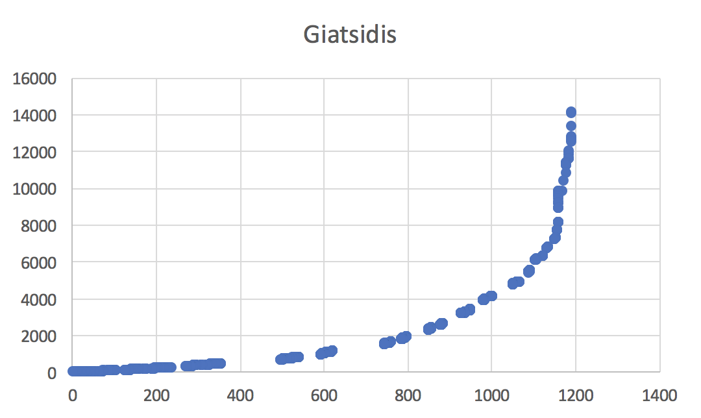
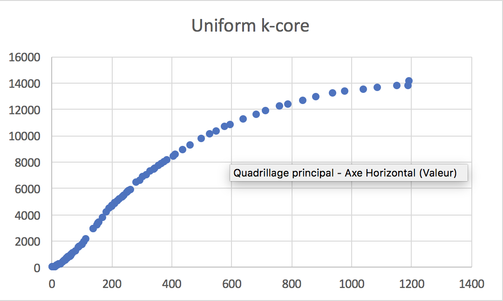
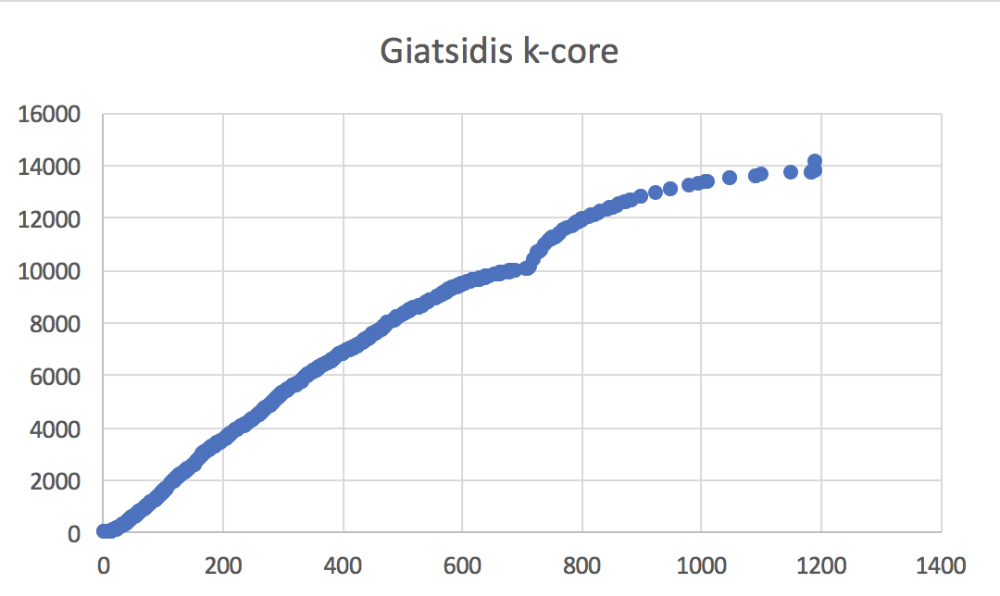

*Note: this document uses math notations (not rendered on GitHub, but rendered in most markdown editor using mathjax). Math mode needs to be converted to simple dollars sign in line mode before migrating anything into LaTeX.*

# SSCR network comparison experiment
This is a note describing the methods used to compare the different filtering schemes applied to code co-occurrence graphs. We switch to this terminology and drop the use of the term tag which denotes a specific entity in Discourse.

## Projecting onto a tag co-occurrence graph

Let $$\cal N$$ denote the whole network gathering codes, content (posts, comments) and users.

We project onto a code co-occurrence graph using three different schemes. Each scheme induces a different weighting on code-code edges.

* Standard projection, counting the number of co-occurrences of code pairs (the usual GraphRyder projection) $${\cal G}_S$$
* Giatsidis projection, computing a sum 1/ tag degree product $${\cal G}_G$$
* Clique adjusting edge weight Giatsidis to 1 / clique size ratio $${\cal G}_C$$

From all of these projections, the standard projection is the baseline (to which other approaches will be compared). All of these projections can be obtained using a [Tulip OneModeProjection plugin](https://github.com/guywiz/PyTulip/tree/master/Algorithms/OneModeProjection).

For more information on Giatsidis et al. approach see:

* 	Giatsidis, C., D. M. Thilikos, et al. (2011). Evaluating Cooperation in Communities with the k-Core Structure. Advances in Social Networks Analysis and Mining (ASONAM), 87-93.

The clique approach is just a variation on the weight function used when projecting edges onto the code one-mode graph.

*Note*:

* In order to properly use the projection plugin, we first need to form a code-content bipartite graph. This is accomplished (within Tulip) by first selecting codes and then extending the selection to all their neighbors. **Caution**: running the Reachable subgraph plugin will not produce the desired result as edges connecting content will be included as well (so the resulting graph is *not* be bipartite).
* Also, we focus the study on content and annotations (codes) covering a period ending in July 2017. This can be changed by resetting a date in the Tulip script.

## Filtering the tag co-occurrence graphs

Denote by $${\cal G} = (V, E)$$ any of the _code-code graphs_ considered in the previous section. Each of those graphs is equipped with a weight property, that is $$\omega: E \mapsto \mathbb R^+$$. The weight of an edge $$e \in E$$ is thus denoted as $$\omega(e)$$.

Each of these weighted one-mode graphs is then filtered to obtain filtrations of subgraphs. That is, sequences of subgraphs ordered using inclusion, namely:	

$$G_0$$ = whole code-code graph, containing $$G_1$$, in turn containing $$G_2$$, ...

The number and size of the subgraphs depend on the filtering scheme used and edge weight $$\omega$$.

*Note*: Isolated nodes still need to be discarded as to help compare subgraph sizes between different approaches.

### Threshold fitering

One first approach is to filter using a threshold applied on edge weights. The subgraph filtration is thus associated with a sequence of (real positive) values $$w_0 = \min_{e \in E} \omega(e) \leq  w_1 \leq w_2 \leq \ldots$$ and where $$G_i$$ is the subgraph induced from edges $$e \in E$$ satisfying $$\omega(e) \geq w_i$$. 

### k-cores
A second approach is to compute (weighted) k-cores. We do not recall here how the k-core statistics is computed (see Giatsidis et al., for instance). A subgraph filtration is then obtained by computing subgraphs induced from nodes having a k-core statistics above some threshold $$w$$.

### Simmelian backbone
We also intend to compute subgraphs obtained by filtering edges based on edge redundancy as defined by Bobo Nick (2013). For now, we do not include this filtration; the code implementing Nick's approach needs to be improved first.

## Results

We now wish to compare subgrpahs obtained following the different approaches. The Tulip file we use contains a whole hierarchy of subgraphs.

* The "discourse whole dataset" is meant to collect all data emerging from two-mode or one-mode subgraphs and should not be used directly.
  * The Tag-Tag Network is the one-mode network derived from the original data.
  * The Interaction Network is the social network derived from the original data.
  * The Forum Network contains everything users, content and tags.
  * Clone original data is the union fo the preceding three.

*Note*: all loops contained in the original data have been discarded.

* The subgraph "discourse - from date" contains the data filtered by date containing all content (users and tags) published before a given date (default is 2017/07/31). A series of subgraphs is derived from this time filtered graph:
 * Two-mode graph contains a clone of the original graph
 * All "tag-graph <*something*>" subgraphs are obtained using a different projection approach. It is these graphs we filter.
 * There are three of them, each filtered using two different filtering shcemes.

*Note*:

* The hierarchy gets computed using a Tulip script used at the command line (and using an existing Tulip graph containing all discourse data).
* The k-core statistics had to be computed from within the Tulip GUI. We discovered a bug (since reported on github) that the k-core does not get stored when invoked from a Tulip script.
* For sake of comparison, we discarded isolated nodes from the different subgraphs.

### Giatsidis or no Giatsidis?

The "Uniform" subgraphs use the standard edge weight induced from the projection onto a one-mode graph: it simply computes how many content (posts, comments) through which codes co-occur. Given two codes $$c_1, c_2$$, that value simply is:

$$\sum_{c_1 - p - c_2} 1$$

that is, we count 1 each time some content $$p$$ links codes $$c_1$$ and $$c_2$$. This is the metric that is actually being used on GraphRyder. (I am using $$p$$ for post, instead of $$c$$ for content to avoid confusion with $$c$$ for code ...)

The Giatsidis subgraphs use a different weighting scheme. Each content $$p$$ is incident to $$n_p$$ codes: this is the number of code neighbors it has in the original data. Giatsidis assigns the edge $$c_1 - c_2$$ the weight:

$$\sum_{c_1 - p - c_2} \frac{1}{n_p}$$

tat is a code with higher degree contributes a smaller value to each of the edge it induces. The difference in how subgraphs are filtered is striking.

*How to read these curves*:

* The curves map the pair (number of nodes, number of edges) to the $$(x, y)$$ position of points. As the threshold goes up, these values go down so the curve should be read from top right towards bottom left.
* The data is accessible from the accompanying csv file (curves_whole.csv).
* The shape of the curve for the standard (no k-core) uniform weighting scheme does explain why the cursor to filter edges is so hard to use with GraphRyder.

 

*Note*:

* There is a third weighting scheme we have used (to compare its behavior on our data). The reasoning is the following. Instead of distributing a content's weight according to its degree (number of code neighbors), we distribute it according to the number of edges it induces (thus the name, since each content induces a clique on the incident codes). The difference between Giatsidis and Clique is however not striking (see the sheet).

### k-core or not k-core?

Another option we have explored is to filter code graphs according to the k-core statistics on nodes. The difference between the resulting filtering is in this case dramatic and requires some thinking. Filtering codes according to k-core acts almost linearly (removing a fixed slice of edges when moving towards larger k-core values). See for yourself.

 

### Comparing subgraphs
(Ongoing)
Compute conditional probabilities $$p_{i,j} = m_{i,j} / m_i$$ where $$m_i =$$ probability for an edge to belong to subgraph $$G_i$$ and $$m_{i,j} =$$ the probability for an edge to be part of both $$G_i$$ and $$G_j$$.
The value $$p_{i,j}$$ then is the probability for an edge to be part of $$G_j$$ *given that* it is part of $$G_i$$. 